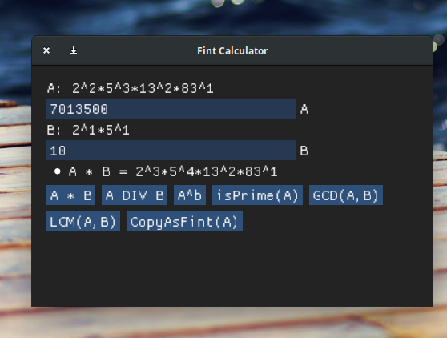
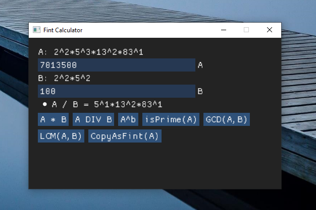

### HOW TO BUILD ON LINUX:

run the script `install.sh` or follow the commands written inside. It will install all the dependencies
needed for this program. (SDL2 / CMAKE)

### HOW TO BUILD ON WINDOWS:

#### Using Visual Studio Code:
Download the SDL2 lib from this link: `https://www.libsdl.org/release/SDL2-devel-2.0.14-VC.zip`
<br/>Unzip the folder in C:/programs/ and rename it `sdl` to make the paths match the `CMakeLists.txt`
```cmake
    set(WHERE-IS-SDL "C:/programs/sdl/lib/x64")
    set(WHERE-IS-SDL-HEADERS "C:/programs/sdl/include")
```
Install Visual Studio Code extensions:
<br/>**CMake**: `https://marketplace.visualstudio.com/items?itemName=twxs.cmake`
<br/>**CMake Tools**: `https://marketplace.visualstudio.com/items?itemName=vector-of-bool.cmake-tools`

One will provide syntax highlighting for CMake and another provide API for calling CMAKE from the Command Palette of visual.
The build directory will set according to the `settings.json` in the project folder.
<br>Press **CTRL + SHIFT + P** to open command palette. 
1) Type: `CMake: Scan for Kits`
2) Type: `CMake: Select a Kit`  *(Then select whatever is your main x64 C++ kit)*
3) Type: `CMake: Configure`
4) Type: `CMake: Build`

By default, it will build a `Debug` configuration, to switch to `Release` type: `CMake: Select Variant` 

**Cautions** 

When you will run the .exe it might say that it needs the SDL2.dll, just copy it next to the executable from `C:/programs/sdl/lib/x64/SDL2.dll`





